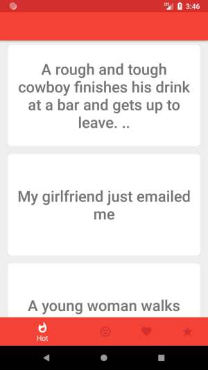
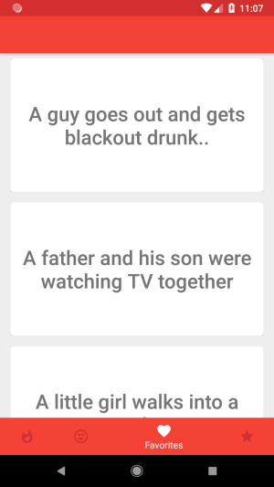

# Jokesby

Jokesby is an Android app that allows users to view the hottest jokes on Reddit and rate their favorites.

Jokes can be saved and rated you love so they can be easily viewed later.

## Project Details

- Created project with MVP architectural structure.
- Implemented API requests using RxJava and Retrofit.
- Created dependency injection components, modules and annotations using Dagger 2.
- Added BottomNavigationView for easy navigation on the main screen.
- Created rating bar in detail screen which adds jokes to rated database.
- Added Admob banner ads via Firebase dependency.

## Example Usage

On the main screen, the hottest jokes are loaded upon launch with a bottom navigation bar below it.

Favorites, rated jokes and a random page of Reddit jokes can be viewed using the bottom navigation bar.

The full joke can be viewed by tapping it in the list. Here users can rate, favorite and share it.

